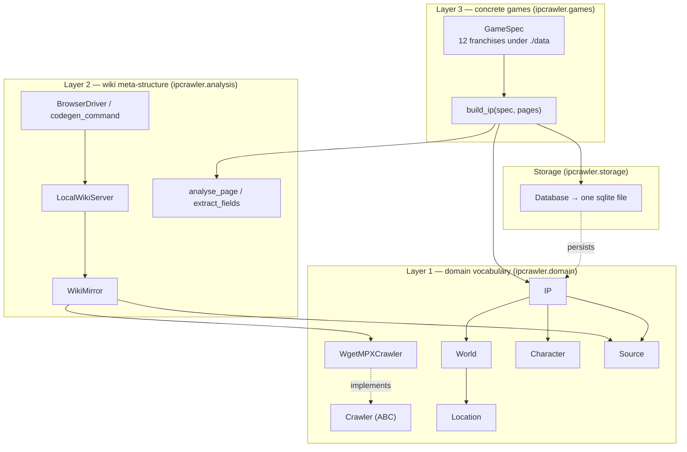
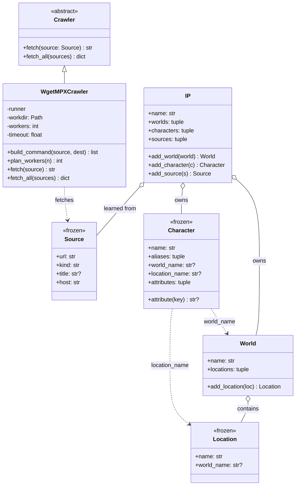
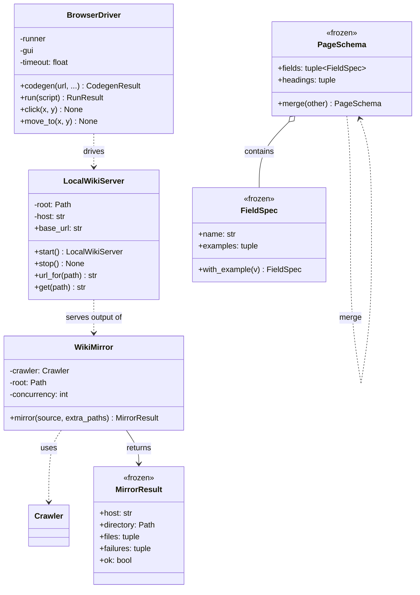
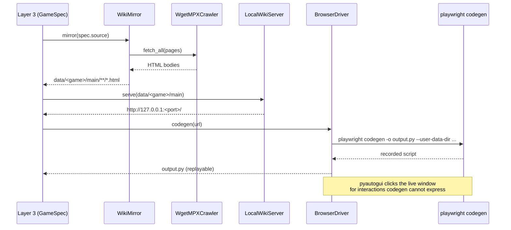
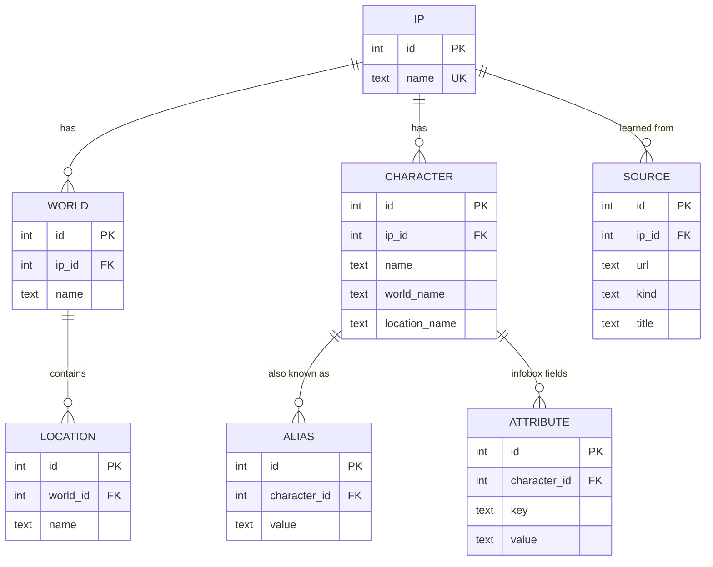
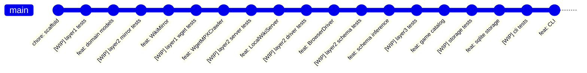

# ip-crawler — three-layer OOP design

This document is the design the plan (`deepseek-harness-plan.md`) asks for: a
three-layer object model, drawn in Mermaid, with the concrete classes filled in.

---

## The three layers at a glance

**Why the dependency arrows only point downward:** layer 3 may use layers 1 and
2, layer 2 may use layer 1, but layer 1 uses nothing. That is what makes the
domain vocabulary reusable and the analysis machinery reusable across games.

---

## Layer 1 — the domain vocabulary

The nouns the whole project speaks in. Nothing here knows about HTTP, sqlite, or
any particular game.

`Source`, `Location`, `Character` are **frozen dataclasses** — structural
equality, hashable, so they can join sets while the graph is assembled.
`IP` and `World` are **aggregate roots** — they own their members, hand out
read-only tuples, and expose `add_*` methods that are idempotent by name.

---

## Layer 2 — wiki meta-structure analysis

"Meta structure" means: *given this wiki, how do I get from a page to a
character's fields?* Layer 2 answers that from the HTML itself, so layer 3 never
hard-codes selectors.

### The mirror → serve → record loop

Serving over loopback rather than opening `file://` matters: a file URL changes
CORS, `fetch`, and relative-URL resolution, so a page that works offline can
behave differently from the same page online.

Three infobox dialects are recognised, which between them cover the target
wikis:

| Dialect | Markup | Seen in |
|---|---|---|
| Table rows | `<tr><th>K</th><td>V</td></tr>` | classic MediaWiki / Fandom |
| Portable infobox | `
<h3 class="pi-data-label">…` | modern Fandom |
| Description list | `<dt>K</dt><dd>V</dd>` | hand-rolled wikis |

---

## Layer 3 — the concrete games

Layer 3 is **data, not subclasses**: each franchise is a `GameSpec` record.

```mermaid
classDiagram
    class GameSpec {
        <<frozen>>
        +slug: str
        +name: str
        +wiki_url: str
        +character_prefix: str
        +world: str?
        +data_dir: str
        +source: Source
        +matches_character_path(p) bool
        +character_name_from_path(p) str
        +mirror_dir(root) Path
    }

    class GameCatalog {
        <<module>>
        GAME_SPECS: tuple
        +get_spec(slug) GameSpec
        +spec_for_slug(dirname) GameSpec
        +discover_local_games(root) tuple
        +build_ip(spec, pages) IP
    }

    GameCatalog o-- GameSpec : GAME_SPECS
    GameCatalog ..> IP : build_ip produces
    GameSpec ..> Source : source
```

The 12 franchises under `./data`, all catalogued in `GAME_SPECS`:

| Slug | Game | Wiki |
|---|---|---|
| `arknights` | Arknights | arknights.fandom.com |
| `bang-dream` | BanG Dream! | bang-dream.fandom.com |
| `blue-archive` | Blue Archive | bluearchive.fandom.com |
| `genshin-impact` | Genshin Impact | genshin-impact.fandom.com |
| `harry-potter-magic-awakened` | Harry Potter: Magic Awakened | harrypotter.fandom.com |
| `kantai-collection` | Kantai Collection | kancolle.fandom.com |
| `lovelive` | Love Live! | love-live.fandom.com |
| `naruto-mobile` | Naruto Mobile | naruto.fandom.com |
| `personality-database-mbti` | Personality Database (MBTI) | personality-database.com |
| `project-seikai` | Project SEKAI | project-sekai.fandom.com |
| `the-fifth-persionality` | The Fifth Personality | id5.fandom.com |
| `touhou-project` | Touhou Project | touhou.fandom.com |

A unit test asserts this catalog and the actual `./data` directory listing agree,
so adding a folder without a spec fails CI.

---

## Storage — one sqlite file

`character.world_name` / `location_name` are stored as **text, not FKs**: wiki
data is messy and a character routinely references a world or faction that was
never enumerated as its own page. Making them hard FKs would reject real data;
keeping them as text and additionally materialising `location` rows when they
are known gives both recall and structure.

Every write uses `INSERT ... ON CONFLICT DO UPDATE` against `UNIQUE`
constraints, so re-crawling the same wiki **converges instead of duplicating**.

---

## TDD history

Each layer was built test-first. `git log` shows the pattern — a `[WIP]` commit
containing only failing tests, then the implementation commit that turns them
green:

